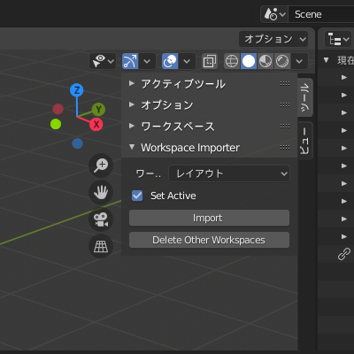

# workspace_importer
workspace_importerはスタートアップファイルに保存されているワークスペースをインポートするアドオンです。  
他ユーザーが作成した.blendのワークスペースを、簡単に自分のワークスペースに切り替えることができます。  

 
## 導入方法
最新版ダウンロードはこちら  
1.編集 > プリファレンス... > アドオン > インストール > ダウンロードした.zipを選択します。  
2.下のリストに「User Interface: Workspace Importer」が表示されるのでチェックを入れて有効化します。  
3.3Dビュー > サイドバー（Nキー） > Workspace Importer　が追加されています。  
  
## 機能一覧
### インポート_Import  
  スタートアップファイルに保存されているワークスペースをインポートします。  
  Make Activeにチェックを入れると、現在のワークスペースがインポートしたワークスペースに切り替わります。  
  元に戻す(Ctrl+z)不可の操作です。  
 
### 削除_Delete Other Workspaces  
  現在開いているワークスペース以外のワークスペースを全て削除します。  
  元に戻す(Ctrl+z)不可の操作です。  
 
## 公式の機能
  本アドオンの機能はすべて公式の機能で代替できます。  
  Blenderには以下のような機能があります。  
### 常にスタートアップ設定のワークスペースで.blendファイルを開く  
  編集 > プリファレンス... > セーブ＆ロード > Blendファイル > UIをロード  
 
### スタートアップ設定のWorkspaceで.blendファイルを開く  
  ファイル > 開く... > オプション（歯車マーク） > UIをロード  
 
### ワークスペースを追加する  
  ワークスペースを追加（+） > 全般 > ワークスペース名  
 
### ワークスペースを削除する  
  ワークスペース名を右クリック > 削除  
 
